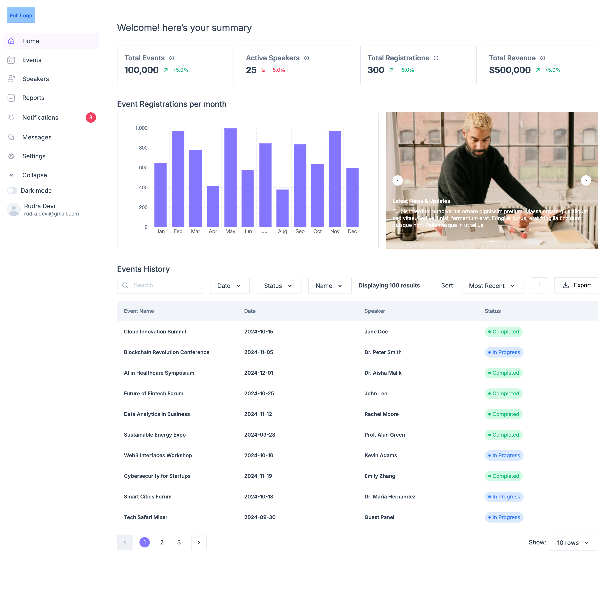
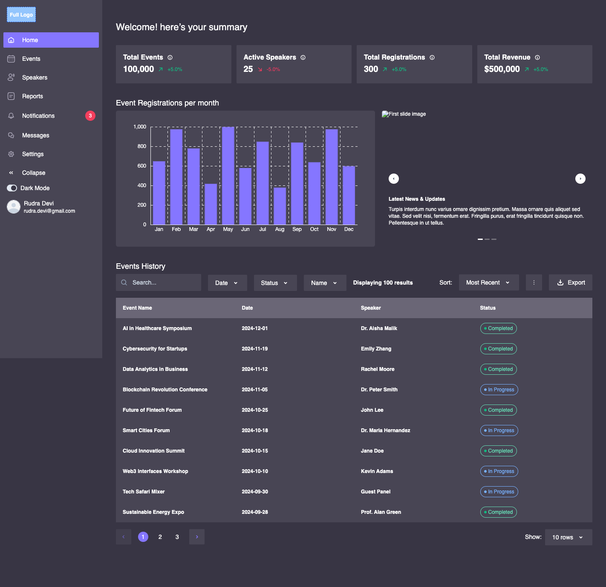
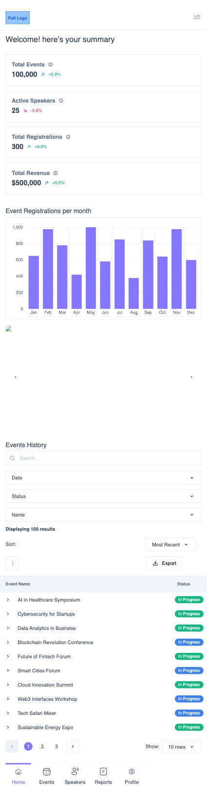
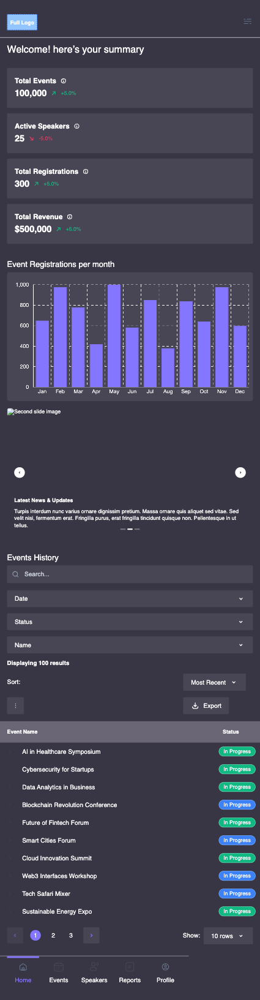

# Event Tracker Application 

A simple concept for an event tracker application built be Bjorn-Donald Bassey as an assessment for a Front End Developer Job application

```bash
# install dependencies
$ npm install

# serve with hot reload at localhost:3000
$ npm dev

# build for production and launch server
$ npm build
$ npm start
```

## Live Demo
There is an online demo [here](https://event-tracker-roan.vercel.app/)




